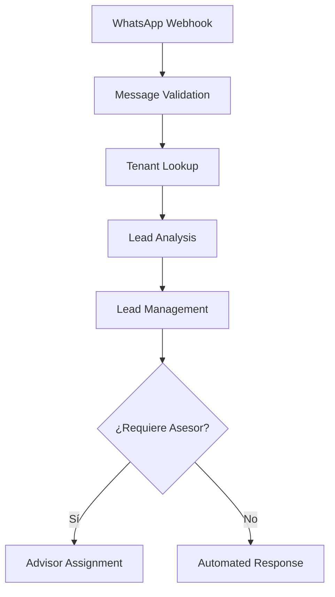

# 🚀 Óptima-CX N8N Workflows

## 📁 Arquitectura Modular por Módulos de Negocio

```
applications/n8n-workflows/
├── 📋 README.md
├── 🎯 leads/
│   ├── lead-analysis-ai.json          # Análisis IA con Gemini
│   ├── lead-assignment.json           # Asignación inteligente de asesores
│   ├── lead-processor-whatsapp.json   # Procesador principal WhatsApp
│   └── lead-scoring-ai.json           # Scoring automático de calidad
│
├── 📊 encuestas/
│   ├── survey-qr-processor.json       # [Pendiente] Procesador encuestas QR
│   ├── survey-whatsapp-campaign.json  # [Pendiente] Campañas WhatsApp
│   ├── survey-call-center-assignment.json # [Pendiente] Asignación contact center
│   ├── survey-alert-low-scores.json   # [Pendiente] Alertas notas bajas
│   └── survey-excel-import.json       # [Pendiente] Importación masiva Excel
│
├── 🎫 reclamos/
│   ├── complaint-rag-processor.json   # [Pendiente] Procesador RAG + IA
│   ├── complaint-auto-assignment.json # [Pendiente] Asignación automática
│   ├── complaint-black-alert.json     # [Pendiente] Alertas black alert
│   ├── complaint-knowledge-ingestion.json # [Pendiente] Ingesta RAG
│   └── complaint-notifications.json   # [Pendiente] Notificaciones
│
├── 🚀 campañas/
│   ├── campaign-whatsapp-bulk.json    # [Pendiente] Envíos masivos WhatsApp
│   ├── campaign-email-automation.json # [Pendiente] Automatización email
│   ├── campaign-followup-sequences.json # [Pendiente] Secuencias seguimiento
│   └── campaign-analytics.json        # [Pendiente] Analytics campañas
│
├── 🔧 utils/
│   ├── tenant-config-loader.json      # Cargador configuración por tenant
│   └── whatsapp-message-validator.json # Validador mensajes WhatsApp
│
└── 📋 templates/
    ├── tenant-onboarding-template.json    # [Pendiente] Template onboarding
    ├── multi-tenant-base-template.json    # [Pendiente] Template base
    └── rag-pipeline-template.json         # [Pendiente] Template RAG
```

## 🏗️ Principios de Arquitectura Implementados

### **🎯 Módulos de Negocio Segregados**
- ✅ **Leads**: Gestión completa de leads de ventas WhatsApp
- 📊 **Encuestas**: Post-venta multicanal (QR, WhatsApp, Llamadas)
- 🎫 **Reclamos**: RAG + IA para clasificación y respuesta automática
- 🚀 **Campañas**: Automatización marketing y followup

### **🔧 Componentes Utilitarios Reutilizables**
- ✅ **Utils**: Funciones comunes multi-tenant
- 📋 **Templates**: Plantillas para nuevos tenants

## Principios SOLID Aplicados

### **S - Single Responsibility Principle**
- ✅ Cada workflow tiene una responsabilidad específica
- ✅ Funciones JavaScript enfocadas en una tarea
- ✅ Separación clara entre validación, análisis y persistencia

### **O - Open/Closed Principle**
- ✅ Workflows extensibles sin modificar código existente
- ✅ Configuración externalizada para diferentes tenants
- ✅ Templates de IA intercambiables

### **L - Liskov Substitution Principle**
- ✅ Workflows pueden ser intercambiados sin afectar el flujo
- ✅ Interfaces consistentes entre workflows

### **I - Interface Segregation Principle**
- ✅ Cada workflow recibe solo los datos que necesita
- ✅ Salidas especializadas por funcionalidad

### **D - Dependency Inversion Principle**
- ✅ Workflows dependen de abstracciones (servicios)
- ✅ Configuración inyectada, no hardcodeada

## Flujo de Ejecución



## Beneficios de la Modularización

### **🔧 Mantenibilidad**
- Cambios aislados por funcionalidad
- Testing independiente de cada módulo
- Debugging más simple y enfocado

### **🚀 Escalabilidad**
- Workflows pueden ejecutarse en paralelo
- Fácil adición de nuevos pasos
- Reutilización de componentes

### **🔒 Robustez**
- Fallos aislados no afectan todo el flujo
- Recuperación granular de errores
- Logging específico por responsabilidad

### **🧪 Testabilidad**
- Unit testing de cada workflow
- Mocking de dependencias específicas
- Validación de inputs/outputs por módulo

## Configuración y Despliegue

### **Variables de Entorno Requeridas**
```env
# Base de datos
DB_HOST=your-postgres-host
DB_NAME=optimacx_db
DB_USER=n8n_user

# APIs externas  
OPENAI_API_KEY=your-openai-key
WHATSAPP_TOKEN=your-whatsapp-token

# N8N
N8N_ENCRYPTION_KEY=your-32-char-key
```

### **Orden de Despliegue**
1. Importar workflows en orden numérico
2. Configurar webhooks de WhatsApp
3. Validar conectividad con base de datos
4. Probar flujo completo con mensaje de prueba

## Monitoreo y Observabilidad

### **Métricas por Workflow**
- **Validation**: Tasa de mensajes válidos/inválidos
- **Tenant Lookup**: Tiempo de respuesta de configuración
- **Analysis**: Precisión y confianza de IA
- **Management**: Latencia de operaciones BD

### **Logging Estructurado**
Cada workflow incluye logging consistente:
```javascript
console.log('Workflow completed:', {
  workflowName: 'message-validation',
  tenantId: context.tenant_id,
  messageId: message.id,
  processingTime: Date.now() - startTime,
  success: true
});
```

## Próximos Pasos

1. **Custom Nodes**: Implementar nodos personalizados reutilizables
2. **Error Handling**: Mejorar manejo de errores y retry logic
3. **Performance**: Optimizar queries y cachear configuraciones
4. **Monitoring**: Implementar alertas y dashboards
5. **Testing**: Crear suite de tests automatizados

## Migration Guide

Para migrar del workflow monolítico:

1. **Respaldar** workflow existente
2. **Importar** nuevos workflows modulares
3. **Actualizar** webhook URL si es necesario
4. **Validar** funcionamiento con casos de prueba
5. **Deshabilitar** workflow anterior
6. **Monitorear** por 24-48 horas

El diseño modular asegura **backward compatibility** durante la migración.