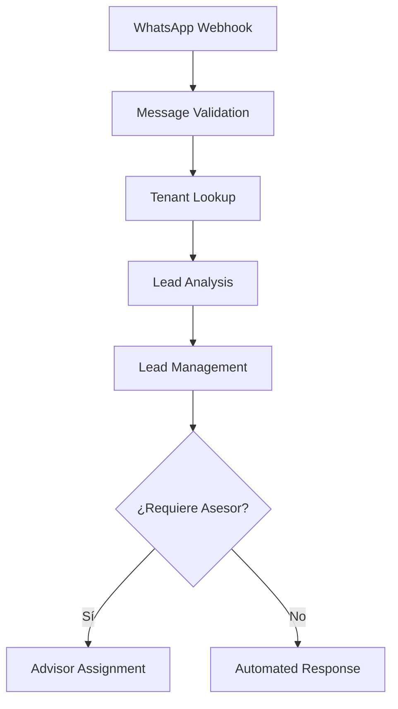

# OptimaCX Platform - Workflows Modularizados

## Transformación de Arquitectura Monolítica a SOLID

### ❌ **Antes - Workflow Monolítico (642 líneas)**
```
01_lead_whatsapp_capture.json
├── Validación webhook
├── Extracción de datos  
├── Lookup de tenant
├── Análisis con IA
├── Creación/actualización de lead
├── Asignación de asesor
├── Envío de respuesta
└── Logging y auditoría
```

### ✅ **Después - Workflows Modulares (SOLID)**

#### **1. WhatsApp Message Validation** (`01_whatsapp_message_validation.json`)
- **SRP**: Solo validación y parseo de mensajes WhatsApp
- **Responsabilidades**: 
  - Validar estructura del webhook
  - Parsear datos del mensaje
  - Normalizar formato de salida
- **Salida**: Mensaje validado y estructurado

#### **2. Tenant Lookup** (`02_tenant_lookup.json`)
- **SRP**: Solo identificación y configuración de tenant
- **Responsabilidades**:
  - Mapear phone_number_id a tenant_id
  - Obtener configuración del tenant
  - Preparar contexto para análisis
- **Salida**: Configuración completa del tenant

#### **3. Lead Analysis** (`03_lead_analysis.json`)
- **SRP**: Solo análisis con IA y extracción de insights
- **Responsabilidades**:
  - Construir contexto para IA
  - Analizar mensaje con IA
  - Procesar y validar respuesta
  - Determinar siguiente acción
- **Salida**: Análisis estructurado del lead

#### **4. Lead Management** (`04_lead_management.json`)
- **SRP**: Solo persistencia y gestión de datos del lead
- **Responsabilidades**:
  - Crear o actualizar lead en BD
  - Registrar auditoría
  - Determinar flujo siguiente
- **Salida**: Confirmación de operación y próximo paso

## Principios SOLID Aplicados

### **S - Single Responsibility Principle**
- ✅ Cada workflow tiene una responsabilidad específica
- ✅ Funciones JavaScript enfocadas en una tarea
- ✅ Separación clara entre validación, análisis y persistencia

### **O - Open/Closed Principle**
- ✅ Workflows extensibles sin modificar código existente
- ✅ Configuración externalizada para diferentes tenants
- ✅ Templates de IA intercambiables

### **L - Liskov Substitution Principle**
- ✅ Workflows pueden ser intercambiados sin afectar el flujo
- ✅ Interfaces consistentes entre workflows

### **I - Interface Segregation Principle**
- ✅ Cada workflow recibe solo los datos que necesita
- ✅ Salidas especializadas por funcionalidad

### **D - Dependency Inversion Principle**
- ✅ Workflows dependen de abstracciones (servicios)
- ✅ Configuración inyectada, no hardcodeada

## Flujo de Ejecución



## Beneficios de la Modularización

### **🔧 Mantenibilidad**
- Cambios aislados por funcionalidad
- Testing independiente de cada módulo
- Debugging más simple y enfocado

### **🚀 Escalabilidad**
- Workflows pueden ejecutarse en paralelo
- Fácil adición de nuevos pasos
- Reutilización de componentes

### **🔒 Robustez**
- Fallos aislados no afectan todo el flujo
- Recuperación granular de errores
- Logging específico por responsabilidad

### **🧪 Testabilidad**
- Unit testing de cada workflow
- Mocking de dependencias específicas
- Validación de inputs/outputs por módulo

## Configuración y Despliegue

### **Variables de Entorno Requeridas**
```env
# Base de datos
DB_HOST=your-postgres-host
DB_NAME=optimacx_db
DB_USER=n8n_user

# APIs externas  
OPENAI_API_KEY=your-openai-key
WHATSAPP_TOKEN=your-whatsapp-token

# N8N
N8N_ENCRYPTION_KEY=your-32-char-key
```

### **Orden de Despliegue**
1. Importar workflows en orden numérico
2. Configurar webhooks de WhatsApp
3. Validar conectividad con base de datos
4. Probar flujo completo con mensaje de prueba

## Monitoreo y Observabilidad

### **Métricas por Workflow**
- **Validation**: Tasa de mensajes válidos/inválidos
- **Tenant Lookup**: Tiempo de respuesta de configuración
- **Analysis**: Precisión y confianza de IA
- **Management**: Latencia de operaciones BD

### **Logging Estructurado**
Cada workflow incluye logging consistente:
```javascript
console.log('Workflow completed:', {
  workflowName: 'message-validation',
  tenantId: context.tenant_id,
  messageId: message.id,
  processingTime: Date.now() - startTime,
  success: true
});
```

## Próximos Pasos

1. **Custom Nodes**: Implementar nodos personalizados reutilizables
2. **Error Handling**: Mejorar manejo de errores y retry logic
3. **Performance**: Optimizar queries y cachear configuraciones
4. **Monitoring**: Implementar alertas y dashboards
5. **Testing**: Crear suite de tests automatizados

## Migration Guide

Para migrar del workflow monolítico:

1. **Respaldar** workflow existente
2. **Importar** nuevos workflows modulares
3. **Actualizar** webhook URL si es necesario
4. **Validar** funcionamiento con casos de prueba
5. **Deshabilitar** workflow anterior
6. **Monitorear** por 24-48 horas

El diseño modular asegura **backward compatibility** durante la migración.