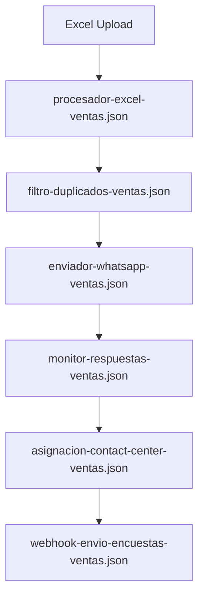
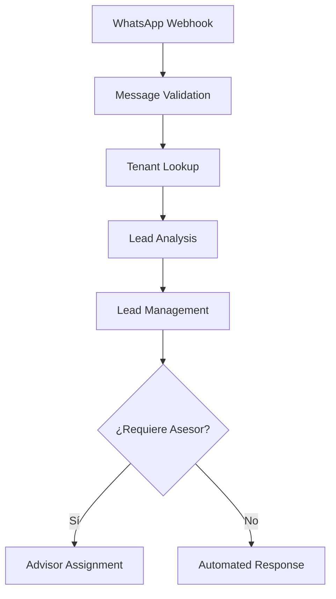

# 🚀 Óptima-CX N8N Workflows

## 📁 Arquitectura Modular por Módulos de Negocio

```
applications/n8n-workflows/
├── 📋 README.md
├── 🎯 leads/
│   ├── analisis-ia-leads.json                    # ✅ Análisis IA con Gemini
│   ├── asignacion-asesores.json                  # ✅ Asignación inteligente de asesores
│   ├── notificaciones-leads.json                 # ✅ Notificaciones de leads
│   ├── procesador-whatsapp-leads.json            # ✅ Procesador principal WhatsApp
│   └── puntuacion-ia-leads.json                  # ✅ Scoring automático de calidad
│
├── 📊 encuestas/
│   ├── postventa/
│   │   ├── asignacion-contact-center.json        # ✅ Asignación a contact center
│   │   ├── enviador-whatsapp.json                # ✅ Envío WhatsApp individual
│   │   ├── exportador-excel.json                 # ✅ Exportación a Excel
│   │   ├── filtro-duplicados.json                # ✅ Filtro de duplicados
│   │   ├── manejador-respuestas.json             # ✅ Manejo de respuestas
│   │   ├── monitor-respuestas.json               # ✅ Monitor de respuestas
│   │   ├── notificador-notas-bajas.json          # ✅ Notificaciones notas bajas
│   │   ├── procesador-excel.json                 # ✅ Procesador de carga Excel
│   │   ├── procesador-qr.json                    # ✅ Procesador encuestas QR
│   │   └── webhook-envio-encuestas.json          # ✅ Webhook de envío
│   │
│   └── ventas/ ⭐ MODULARIZADO (6 workflows SRP)
│       ├── asignacion-contact-center-ventas.json # ✅ Asignación equitativa agentes
│       ├── enviador-masivo-whatsapp-ventas.json  # ✅ Envío masivo WhatsApp ventas
│       ├── enviador-whatsapp-ventas.json         # ✅ Envío individual WhatsApp
│       ├── exportador-excel-ventas.json          # ✅ Exportación Excel ventas
│       ├── filtro-duplicados-ventas.json         # ✅ Filtro duplicados ventas
│       ├── manejador-respuestas-ventas.json      # ✅ Manejo respuestas ventas
│       ├── monitor-respuestas-ventas.json        # ✅ Monitor respuestas (6h)
│       ├── notificador-notas-bajas-ventas.json   # ✅ Notificaciones bajas ventas
│       ├── procesador-excel-ventas.json          # ✅ Procesador carga Excel
│       ├── procesador-qr-ventas.json             # ✅ Procesador QR ventas
│       └── webhook-envio-encuestas-ventas.json   # ✅ Webhook recepción encuestas
│
├── 🎫 reclamos/
│   ├── alerta-black-alert.json                   # ✅ Alertas Black Alert
│   ├── almacenamiento-conocimiento.json          # ✅ Almacenamiento RAG
│   ├── asignacion-automatica-reclamos.json       # ✅ Asignación automática
│   ├── fragmentacion-conocimiento.json           # ✅ Chunking de documentos
│   ├── generador-embeddings.json                 # ✅ Generador de embeddings
│   ├── ingesta-conocimiento.json                 # ✅ Ingesta de conocimiento
│   ├── notificaciones-reclamos.json              # ✅ Notificaciones de reclamos
│   └── procesador-rag-reclamos.json              # ✅ Procesador RAG + IA
│
├── 🚀 campañas/
│   ├── analiticas-campañas.json                  # ✅ Analíticas de campañas
│   ├── automatizacion-email.json                 # ✅ Automatización de email
│   ├── envio-masivo-whatsapp.json                # ✅ Envío masivo WhatsApp
│   └── secuencias-seguimiento.json               # ✅ Secuencias de seguimiento
│
├── 🔧 utils/
│   ├── cargador-config-tenant.json               # ✅ Cargador configuración tenant
│   ├── manejador-errores.json                    # ✅ Manejador de errores
│   ├── optimizador-base-datos.json               # ✅ Optimizador de BD
│   ├── utilidad-validacion.json                  # ✅ Utilidades de validación
│   └── validador-mensajes-whatsapp.json          # ✅ Validador mensajes WhatsApp
│
└── 📋 templates/
    ├── tenant-onboarding-template.json    # [Pendiente] Template onboarding
    ├── multi-tenant-base-template.json    # [Pendiente] Template base
    └── rag-pipeline-template.json         # [Pendiente] Template RAG
```

## 🏗️ Principios de Arquitectura Implementados

### **🎯 Módulos de Negocio Segregados**
- ✅ **Leads**: Gestión completa de leads de ventas WhatsApp
- 📊 **Encuestas**: 
  - **Post-venta**: Multicanal (QR, WhatsApp, Llamadas) - 10 workflows modulares
  - **Ventas**: Satisfacción de ventas (QR_VENTAS, WhatsApp_VENTAS, Llamada_VENTAS) - 6 workflows modulares ⭐
- 🎫 **Reclamos**: RAG + IA para clasificación y respuesta automática
- 🚀 **Campañas**: Automatización marketing y followup

### **🔧 Componentes Utilitarios Reutilizables**
- ✅ **Utils**: Funciones comunes multi-tenant
- 📋 **Templates**: Plantillas para nuevos tenants

## ⭐ Modularización Completa de Encuestas de Ventas

### **Arquitectura Modular Implementada**
Se completó la modularización de encuestas de ventas siguiendo el mismo patrón de post-venta, con **6 workflows especializados** que implementan el principio **Single Responsibility Principle (SRP)**:

### **🔄 Flujo Modular de Encuestas de Ventas**


### **📋 Workflows de Ventas Modulares**

| Workflow | Responsabilidad | Input | Output |
|----------|----------------|-------|--------|
| **procesador-excel-ventas.json** | Procesar datos Excel de clientes | Excel con datos de ventas | Clientes validados |
| **filtro-duplicados-ventas.json** | Eliminar duplicados | Lista de clientes | Clientes únicos |  
| **enviador-whatsapp-ventas.json** | Envío individual WhatsApp | Cliente individual | Mensaje enviado |
| **monitor-respuestas-ventas.json** | Monitorear respuestas (6h) | Campaña enviada | Clientes sin respuesta |
| **asignacion-contact-center-ventas.json** | Asignar a agentes | Clientes sin respuesta | Asignaciones equitativas |
| **webhook-envio-encuestas-ventas.json** | Recibir encuestas completadas | Encuesta completada | Registro procesado |

### **🎯 Diferencias Clave: Ventas vs Post-venta**

| Aspecto | Post-venta | Ventas |
|---------|------------|--------|
| **Tabla BD** | `encuestas` | `encuestas_ventas` |
| **Campos específicos** | `tipo_servicio`, `asesor_servicio` | `vehiculo_modelo`, `asesor_ventas_id` |
| **Puntuaciones** | `recomendacion`, `satisfaccion`, `lavado`, `asesor` | `recomendacion`, `atencion_asesor`, `proceso_entrega`, `satisfaccion_general` |
| **Roles responsables** | `jefe_servicio`, `asesor_servicio` | `jefe_ventas`, `asesor_ventas` |
| **Orígenes** | `QR`, `WhatsApp`, `Llamada` | `QR_VENTAS`, `WhatsApp_VENTAS`, `Llamada_VENTAS` |

### **✅ Beneficios de la Modularización**
- **Mantenibilidad**: Cada workflow tiene una responsabilidad específica
- **Escalabilidad**: Fácil agregar nuevos pasos al flujo
- **Robustez**: Fallos aislados no afectan todo el proceso
- **Testabilidad**: Testing independiente de cada módulo
- **Reutilización**: Workflows pueden ser reutilizados en otros contextos

## Principios SOLID Aplicados

### **S - Single Responsibility Principle**
- ✅ Cada workflow tiene una responsabilidad específica
- ✅ Funciones JavaScript enfocadas en una tarea
- ✅ Separación clara entre validación, análisis y persistencia

### **O - Open/Closed Principle**
- ✅ Workflows extensibles sin modificar código existente
- ✅ Configuración externalizada para diferentes tenants
- ✅ Templates de IA intercambiables

### **L - Liskov Substitution Principle**
- ✅ Workflows pueden ser intercambiados sin afectar el flujo
- ✅ Interfaces consistentes entre workflows

### **I - Interface Segregation Principle**
- ✅ Cada workflow recibe solo los datos que necesita
- ✅ Salidas especializadas por funcionalidad

### **D - Dependency Inversion Principle**
- ✅ Workflows dependen de abstracciones (servicios)
- ✅ Configuración inyectada, no hardcodeada

## Flujo de Ejecución



## Beneficios de la Modularización

### **🔧 Mantenibilidad**
- Cambios aislados por funcionalidad
- Testing independiente de cada módulo
- Debugging más simple y enfocado

### **🚀 Escalabilidad**
- Workflows pueden ejecutarse en paralelo
- Fácil adición de nuevos pasos
- Reutilización de componentes

### **🔒 Robustez**
- Fallos aislados no afectan todo el flujo
- Recuperación granular de errores
- Logging específico por responsabilidad

### **🧪 Testabilidad**
- Unit testing de cada workflow
- Mocking de dependencias específicas
- Validación de inputs/outputs por módulo

## Configuración y Despliegue

### **Variables de Entorno Requeridas**
```env
# Base de datos
DB_HOST=your-postgres-host
DB_NAME=optimacx_db
DB_USER=n8n_user

# APIs externas  
OPENAI_API_KEY=your-openai-key
WHATSAPP_TOKEN=your-whatsapp-token

# N8N
N8N_ENCRYPTION_KEY=your-32-char-key
```

### **Orden de Despliegue**
1. Importar workflows en orden numérico
2. Configurar webhooks de WhatsApp
3. Validar conectividad con base de datos
4. Probar flujo completo con mensaje de prueba

## Monitoreo y Observabilidad

### **Métricas por Workflow**
- **Validation**: Tasa de mensajes válidos/inválidos
- **Tenant Lookup**: Tiempo de respuesta de configuración
- **Analysis**: Precisión y confianza de IA
- **Management**: Latencia de operaciones BD

### **Logging Estructurado**
Cada workflow incluye logging consistente:
```javascript
console.log('Workflow completed:', {
  workflowName: 'message-validation',
  tenantId: context.tenant_id,
  messageId: message.id,
  processingTime: Date.now() - startTime,
  success: true
});
```

## Próximos Pasos

1. **Custom Nodes**: Implementar nodos personalizados reutilizables
2. **Error Handling**: Mejorar manejo de errores y retry logic
3. **Performance**: Optimizar queries y cachear configuraciones
4. **Monitoring**: Implementar alertas y dashboards
5. **Testing**: Crear suite de tests automatizados

## Migration Guide

Para migrar del workflow monolítico:

1. **Respaldar** workflow existente
2. **Importar** nuevos workflows modulares
3. **Actualizar** webhook URL si es necesario
4. **Validar** funcionamiento con casos de prueba
5. **Deshabilitar** workflow anterior
6. **Monitorear** por 24-48 horas

El diseño modular asegura **backward compatibility** durante la migración.