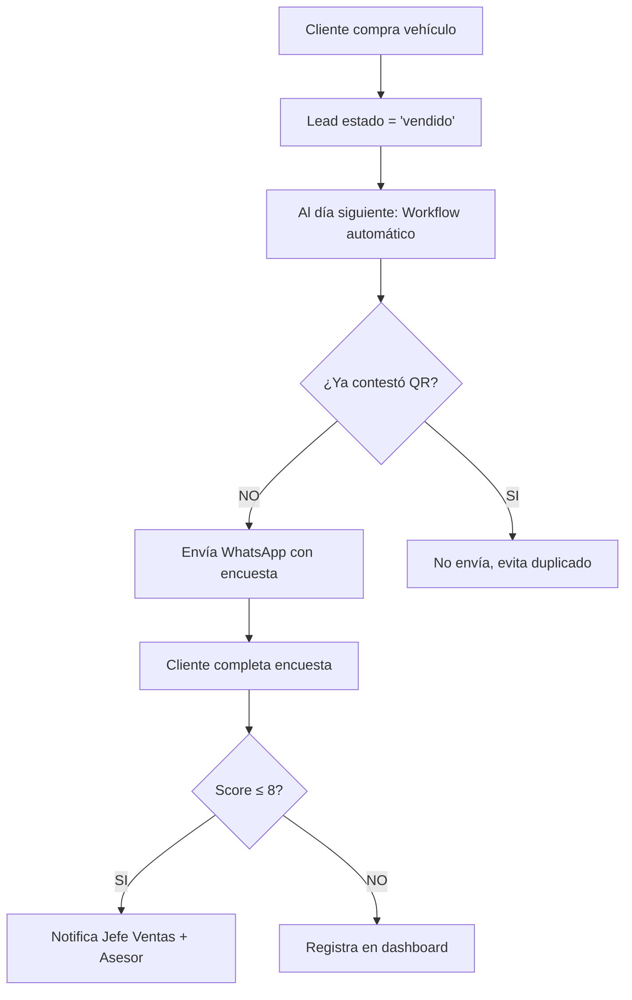

# 📊 Módulo de Encuestas de Ventas - OptimaCX

## 🎯 **IMPLEMENTACIÓN COMPLETADA**

Este módulo implementa el sistema completo de encuestas de satisfacción de ventas con automatización multicanal según las especificaciones de CLAUDE.md.

## 🗄️ **BASE DE DATOS**

### **Tabla `encuestas_ventas` (CREADA)**
```sql
-- Ubicación: /database/migrations/13_create_encuestas_ventas_table.sql
```

**Campos principales:**
- `experiencia_venta` (1-10): Experiencia general proceso de compra
- `satisfaccion_asesor_ventas` (1-10): Satisfacción con asesor
- `claridad_informacion` (1-10): Claridad de información
- `recomendacion_venta` (1-10): Probabilidad de recomendar (NPS)
- `average_score`: Promedio automático (trigger)
- `origen`: QR_VENTAS | WhatsApp_VENTAS | Llamada_VENTAS | WhatsApp_PERDIDO
- `requiere_notificacion`: Auto-calculado si score ≤ 8

## 🔄 **WORKFLOWS N8N IMPLEMENTADOS**

### **1. Encuestas QR de Ventas**
- **Archivo:** `encuestas-ventas-qr.json`
- **Webhook:** `/webhook/encuesta-ventas-qr`
- **Función:** Procesa encuestas desde códigos QR en entrega
- **Automatización:** Score ≤ 8 dispara notificaciones

### **2. Envío Automático WhatsApp**
- **Archivo:** `encuestas-ventas-whatsapp-automatico.json`  
- **Trigger:** Diario 10:00 AM
- **Función:** 
  - Busca leads vendidos ayer
  - Filtra los que ya tienen encuesta (QR)
  - Envía WhatsApp con enlace personalizado
  - Crea encuesta pendiente en DB

### **3. Notificador Score Bajo**
- **Archivo:** `notificador-encuestas-ventas-score-bajo.json`
- **Webhook:** `/webhook/notification-sales-survey-low-score`
- **Destinatarios:** Jefe Ventas, Asesor específico, Gerencia
- **Trigger:** Automático cuando average_score ≤ 8

## 🚀 **FLUJO COMPLETO AUTOMATIZADO**



## 🎛️ **CONFIGURACIÓN MULTI-TENANT**

Cada concesionario necesita:

```json
{
  "whatsapp": {
    "access_token": "token_especifico",
    "phone_number": "+56912345678"
  },
  "email": {
    "from_email": "ventas@concesionario.com",
    "smtp_config": "..."
  },
  "branding": {
    "nombre": "Concesionario XYZ",
    "logo_url": "https://...",
    "color_primario": "#007bff"
  }
}
```

## 📋 **SIGUIENTE PASOS PARA DEPLOYMENT**

### **1. APLICAR MIGRACIÓN DE DB**
```bash
# Ejecutar en Supabase
psql -h your-supabase-host -U postgres -d postgres < database/migrations/13_create_encuestas_ventas_table.sql
```

### **2. DESPLEGAR WORKFLOWS EN N8N**
```bash
# Importar workflows desde:
- applications/workflows/business/encuestas/encuestas-ventas-qr.json
- applications/workflows/business/encuestas/encuestas-ventas-whatsapp-automatico.json  
- applications/workflows/business/encuestas/notificador-encuestas-ventas-score-bajo.json
```

### **3. CONFIGURAR WEBHOOKS**
- Frontend QR: `POST /webhook/encuesta-ventas-qr`
- Notificaciones: `POST /webhook/notification-sales-survey-low-score`

### **4. TESTING**
- Crear lead de prueba estado 'vendido'
- Verificar que se crea encuesta automática al día siguiente
- Probar QR y verificar filtrado de duplicados
- Confirmar notificaciones con score ≤ 8

## ✅ **CUMPLIMIENTO CLAUDE.MD**

- ✅ 4 preguntas específicas de ventas (1-10)
- ✅ 3 canales: QR, WhatsApp automático, Contact Center
- ✅ Filtrado inteligente de duplicados  
- ✅ Notificaciones score ≤ 8 a roles específicos
- ✅ Integración con módulo de leads existente
- ✅ Multitenant con RLS en Supabase
- ✅ Triggers para leads vendidos y perdidos

## 🔧 **TROUBLESHOOTING**

### **Error: Tabla no existe**
```bash
# Verificar si migración se aplicó
SELECT * FROM information_schema.tables WHERE table_name = 'encuestas_ventas';
```

### **Error: Workflows no funcionan**
- Verificar credenciales Supabase en N8N
- Confirmar configuración de tenant en workflow settings
- Revisar logs de N8N para errores específicos

---

**Status:** ✅ IMPLEMENTADO - Listo para deployment  
**Autor:** OptimaCX Platform  
**Fecha:** 2025-08-11
